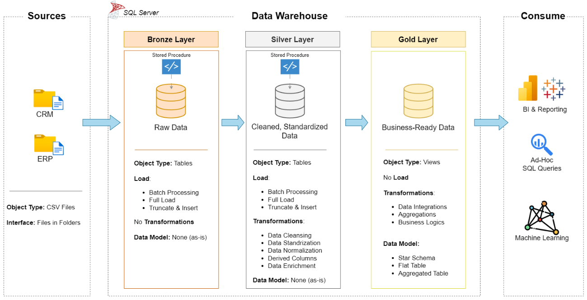

# SQL-Data-Warehouse-and-Analytics-Project
This project shows how to build a complete data warehouse and analytics solution—from collecting raw data to creating insights that help in decision-making. It follows industry best practices in data engineering and analytics and is designed as a strong portfolio project.

---

## Data Architecture
The data architecture for this project follows Medallion Architecture **Bronze**, **Silver**, and **Gold** layers:


- **Bronze Layer (Raw Data):**  
  - Stores data as-is from ERP and CRM source systems.  
  - Data is ingested from CSV files into SQL Server.  

- **Silver Layer (Clean Data):**  
  - Cleans and standardizes raw data.  
  - Ensures accuracy, consistency, and usability.  

- **Gold Layer (Business-Ready Data):**  
  - Transforms clean data into a star schema (fact and dimension tables).  
  - Optimized for reporting and analytics.  

---

## Project Overview

This project covers the end-to-end flow of a modern data warehouse:

1. **Data Architecture** – Build Bronze, Silver, and Gold layers.  
2. **ETL Pipelines** – Extract, Transform, Load (ETL) using SQL scripts.  
3. **Data Modeling** – Create fact and dimension tables for analytics.  
4. **Analytics & Reporting** – Run SQL queries and dashboards for insights.  

---

## Project Requirements

### 1. Data Engineering – Build the Warehouse
**Objective:** Create a SQL Server-based data warehouse to consolidate sales data.  

**Specifications:**  
- **Data Sources:** ERP and CRM datasets provided as CSV files.  
- **Data Quality:** Fix errors, duplicates, and formatting issues.  
- **Integration:** Merge ERP & CRM into a unified, analysis-friendly model.  
- **Scope:** Use only the most recent dataset (no history needed).  
- **Documentation:** Provide clear guidance for business and analytics teams.  

---

### 2. Data Analysis – Analytics & Reporting
**Objective:** Deliver SQL-based insights for business decisions.  

**Analytics focus areas:**  
- Customer Behavior → Best customers, segmentation, and loyalty.  
- Product Performance → Top/bottom products by sales.  
- Sales Trends → Growth, seasonality, and KPIs.  

These insights help managers make data-driven decisions.  

---
## 📂 Repository Structure
```
data-warehouse-project/
│
├── datasets/                           # Raw datasets used for the project (ERP and CRM data)
│
├── docs/                               # Project documentation and architecture details                     
│   ├── data_architecture.drawio        # Draw.io file shows the project's architecture
│   ├── data_catalog.md                 # Catalog of datasets, including field descriptions and metadata
│   ├── data_flow.drawio                # Draw.io file for the data flow diagram
│   ├── data_models.drawio              # Draw.io file for data models (star schema)
│   ├── naming-conventions.md           # Consistent naming guidelines for tables, columns, and files
│
├── scripts/                            # SQL scripts for ETL and transformations
│   ├── bronze/                         # Scripts for extracting and loading raw data
│   ├── silver/                         # Scripts for cleaning and transforming data
│   ├── gold/                           # Scripts for creating analytical models
│
├── tests/                              # Test scripts and quality files
│
├── README.md                           # Project overview and instructions
├── LICENSE                             # License information for the repository
├── .gitignore                          # Files and directories to be ignored by Git
└── requirements.txt                    # Dependencies and requirements for the project
```
---


